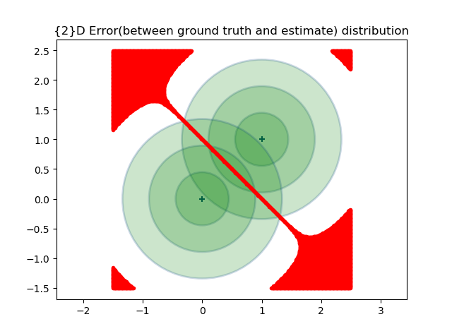
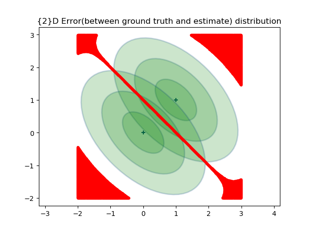
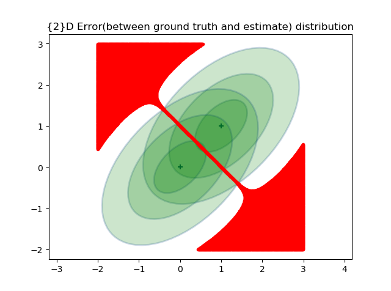
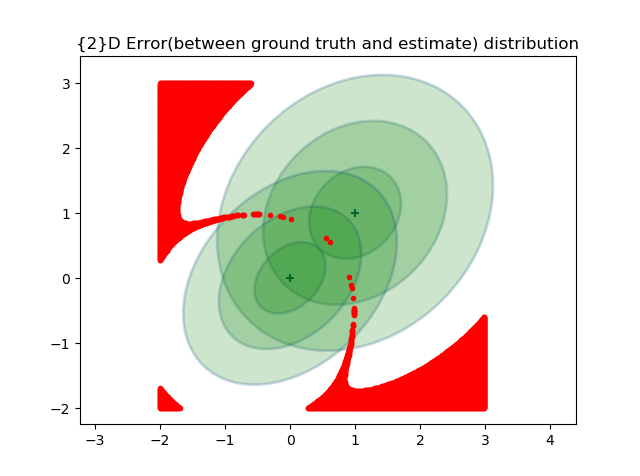
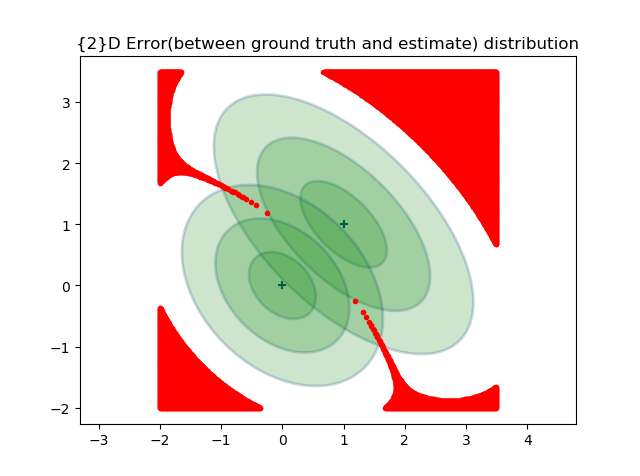
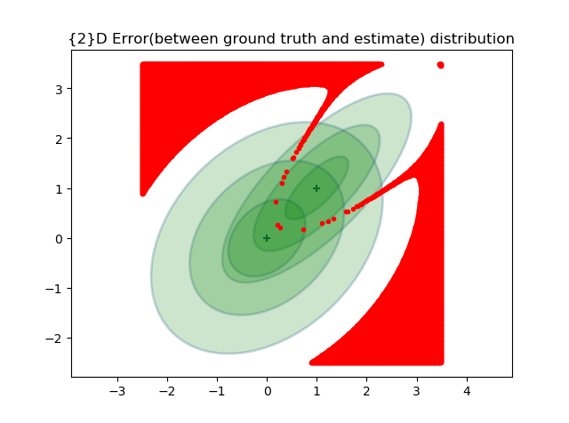
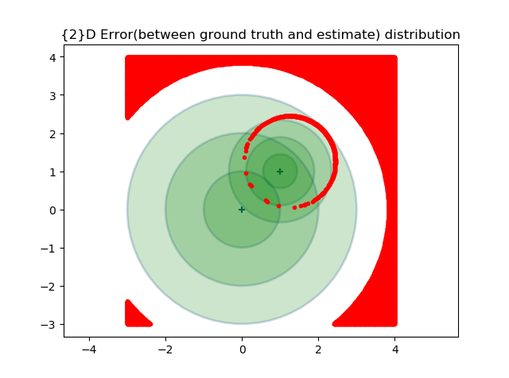
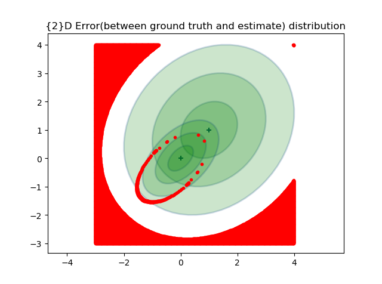
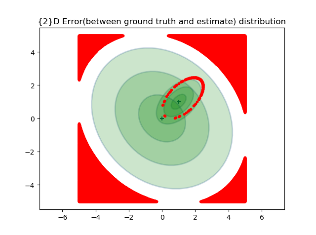

# Binary hypothesis testing nd

$$
u_t=\left\{
\begin{aligned}
H_0: 0 & (𝑛𝑜 𝑒𝑣𝑒𝑛𝑡𝑠 ℎ𝑎𝑝𝑝𝑒𝑛 𝑐𝑎𝑠𝑒)  \\
H_1: 1 & (𝑒𝑣𝑒𝑛𝑡𝑠 ℎ𝑎𝑝𝑝𝑒𝑛 𝑐𝑎𝑠𝑒) \\
\end{aligned}
\right.
$$

* $Prob\{decide H_1 |H_1 true\} =P_D = ∫ \limits_{D} N(HB∗1,σ^2)$ // latex words in Latex 

* $Prob\{decide H_1 |H_0 true\} =P_{FA} = \int \limits_{D} N(HB∗0,σ^2)$

* $Prob\{decide H_0│H_1 true\}=P_M=1-P_D$

* $Prob\{decide H_0│H_0 true\}=P_{CR}=1-P_{FA}$

  where, $D = \{f(HB∗1,σ^2) > f(HB∗0,σ^2)\}$

Based on these equations, for high-dimensional cases, we used sampling based algorithm to calculate the intersection and $P_D,P_{FA},P_M,P_{CR}$

Take 2d cases as example. In the following pictures, The red region is where $abs(f(HB∗1,σ^2) - f(HB∗0,σ^2))<0.001$

### Scenario 1:

$\Sigma_1 = \Sigma_0$  case

#### Example 1

$$
\Sigma_0=\Sigma_1= \begin{bmatrix}
0.2 & 0 \\
0 & 0.2 
\end{bmatrix}
$$

$P_D = 0.9421,P_{FA}=0.0561,P_M=0.0579,P_{CR}=0.9438$

#### Example 2

$$
\Sigma_0= \Sigma_1= \begin{bmatrix}
0.4 & -0.2 \\
-0.2 & 0.4 
\end{bmatrix},
$$

$P_D = 0.9421,P_{FA}=0.0561,P_M=0.0579,P_{CR}=0.9438$

#### Example 3

$$
\Sigma_0= \Sigma_1= \begin{bmatrix}
0.4 & 0.2 \\
0.2 & 0.4 
\end{bmatrix},
$$

$P_D = 0.8203,P_{FA}=0.1821,P_M=0.1797,P_{CR}=0.8178$

### Scenario 2

$\Sigma_1 \neq \Sigma_0$ with diagonal terms case

#### Example 1

$$
\Sigma_0= \begin{bmatrix}
0.3 & 0.1 \\
0.1 & 0.3 
\end{bmatrix},
\Sigma_0= \begin{bmatrix}
0.5 & 0.1 \\
0.1 & 0.5 
\end{bmatrix}
$$
$P_D = 0.8271,P_{FA}= 0.1268,P_M= 0.1729,P_{CR}= 0.8732$

#### Example 2

$$
\Sigma_0= \begin{bmatrix}
0.3 & -0.1 \\
-0.1 & 0.3 
\end{bmatrix},
\Sigma_0= \begin{bmatrix}
0.5 & -0.3 \\
-0.3 & 0.5 
\end{bmatrix}
$$

$P_D = 0.9447,P_{FA}= 0.0548,P_M=0.0552,P_{CR}=0.9452$

#### Example 3

$$
\Sigma_0= \begin{bmatrix}0.6 & 0.2 \\0.2 & 0.6 \end{bmatrix},\Sigma_0= \begin{bmatrix}
0.4 & 0.3 \\0.3 & 0.4 \end{bmatrix}
$$

$P_D = 0.8433,P_{FA}=0.1943,P_M=0.1567,P_{CR}=0.8057$

### Scenario 3

magnitude between $\Sigma_1$ and $\Sigma_0$ is huge

#### Example 1

$$
\Sigma_0= \begin{bmatrix}
1 & 0.0 \\
0.0 & 1 
\end{bmatrix},
\Sigma_0= \begin{bmatrix}
0.2 & 0 \\
0 & 0.2 
\end{bmatrix}
$$
$P_D = 0.9371,P_{FA}=0.1704,P_M=0.0629,P_{CR}=0.8296$

#### Example 2

$$
\Sigma_0= \begin{bmatrix}
0.2 & 0.1 \\
0.1 & 0.2
\end{bmatrix},
\Sigma_0= \begin{bmatrix}
1 & 0.2 \\
0.2 & 1 
\end{bmatrix}
$$
$P_D = 0.8236,P_{FA}=0.690,P_M=0.1763,P_{CR}=0.9310$

#### Example 3

$$
\Sigma_0= \begin{bmatrix}
2 & -0.4 \\
-0.4 & 2 
\end{bmatrix},
\Sigma_0= \begin{bmatrix}
0.2 & -0.1 \\
-0.1 & 0.2 
\end{bmatrix}
$$
$P_D = 0.9867,P_{FA}=0.1344,P_M=0.0433,P_{CR}= 0.8656$

