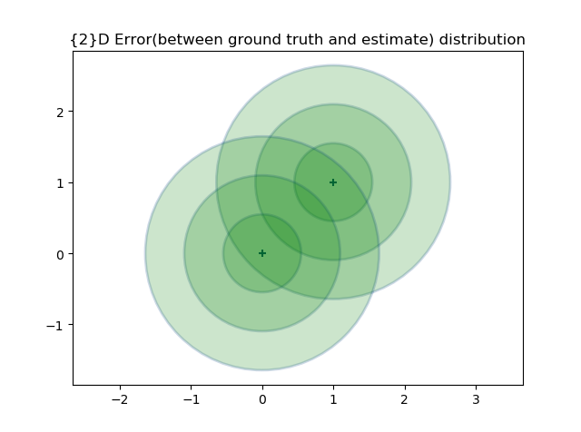
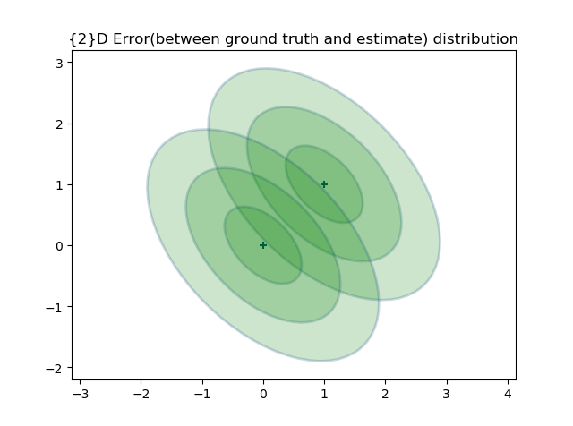
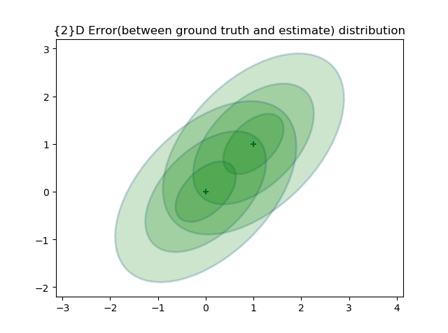
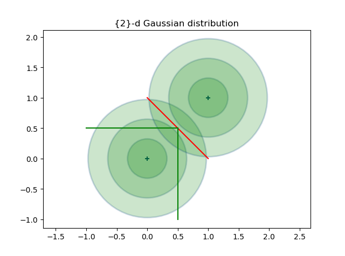
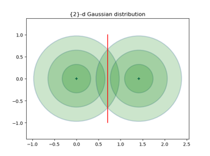
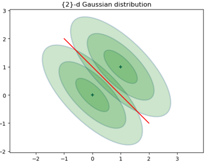
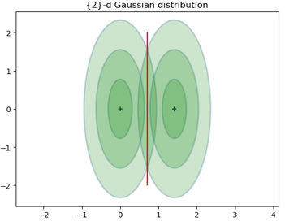
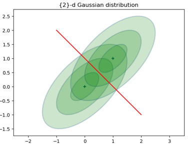
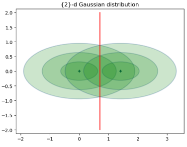

# Week6

## Different 2d scenarios

Same mean0 $\mu_0 = [0,0]$and mean1 $\mu_1 = [1,1]$but different Sigma0 and Sigma1

### Case1 Examples

$\Sigma_1 = \Sigma_0$  case:
$$
\Sigma_0=\Sigma_1= \begin{bmatrix}
0.3 & 0 \\
0 & 0.3 
\end{bmatrix}
$$

$$
\Sigma_0= \Sigma_1= \begin{bmatrix}
0.4 & -0.2 \\
-0.2 & 0.4 
\end{bmatrix},
$$

$$
\Sigma_0= \Sigma_1= \begin{bmatrix}
0.4 & 0.2 \\
0.2 & 0.4 
\end{bmatrix},
$$

### Case 2 Examples

$\Sigma_1 \neq \Sigma_0$ with diagonal terms case:

$$
\Sigma_0= \begin{bmatrix}
0.3 & 0.1 \\
0.1 & 0.3 
\end{bmatrix},
\Sigma_0= \begin{bmatrix}
0.5 & 0.1 \\
0.1 & 0.5 
\end{bmatrix}
$$

$$
\Sigma_0= \begin{bmatrix}
0.3 & -0.1 \\
-0.1 & 0.3 
\end{bmatrix},
\Sigma_0= \begin{bmatrix}
0.5 & -0.3 \\
-0.3 & 0.5 
\end{bmatrix}
$$

$$
\Sigma_0= \begin{bmatrix}
0.6 & 0.2 \\
0.2 & 0.6 
\end{bmatrix},
\Sigma_0= \begin{bmatrix}
0.4 & 0.2 \\
0.3 & 0.4 
\end{bmatrix}
$$

### Case 3 Examples

magnitude between $\Sigma_1$ and $\Sigma_0$ is huge:
$$
\Sigma_0= \begin{bmatrix}
0.2 & 0.0 \\
0.0 & 0.2 
\end{bmatrix},
\Sigma_0= \begin{bmatrix}
2 & 0 \\
0 & 2 
\end{bmatrix}
$$

$$
\Sigma_0= \begin{bmatrix}
0.2 & 0.1 \\
0.1 & 0.2 
\end{bmatrix},
\Sigma_0= \begin{bmatrix}
2 & 0.2 \\
0.2 & 2 
\end{bmatrix}
$$

$$
\Sigma_0= \begin{bmatrix}
2 & -0.1 \\
-0.1 & 2 
\end{bmatrix},
\Sigma_0= \begin{bmatrix}
0.2 & -0.1 \\
-0.1 & 0.2 
\end{bmatrix}
$$

## Some observations from correlation

There are three correlation between variables:

* Variables are independent of each other ($ind$)
* Variables have positive correlation ($pos$)
* Variables have negative correlation ($neg$)

In 2d case, some observations we can make based on 2d error Gaussian distribution:

* $P_D^{neg}>P_D^{ind}>P_D^{pos}$
* Under the condition that covariance have the same diagonal terms, the error probability of detection that variables have negative correlation is greater than the one that variables are independent of each other.
* Under the condition that covariance have the same diagonal terms, the error probability of detection that variables are independent of each other is greater than the one that Variables have positive correlation.

 

 

 

These observations may lead to some weird phenomena:

- When we use two positively correlated observations on one sensor of a satellite to measure some quantities of volcano eruption, the error probability of detection $ P_D $ is actually smaller then two independent observations on two sensors of a satellite
- When we use two negatively correlated observations on one sensor of a satellite to measure some quantities of volcano eruption, the error probability of detection $ P_D $ is actually smaller then two independent observations on two sensors of a satellite

## Some reference 

I found some reference online that could calculate the overlapping rate($OLG$) of 2 Gaussian model. By calculating the $OLG$, they can evaluate the separability of gaussian mixture model clustering:

[1] *Haojun Sun*. ([Measuring the component overlapping in the Gaussian mixture model](https://link.springer.com/article/10.1007/s10618-011-0212-3))

This article couldn't help since in our case, we are not dealing with GMM. But it still give me some insights:

* The two peak points and the saddle points should be extreme points on the entire surface
* The two peaks and the saddle points should be extreme points on the whole surface and the saddle points will be on the curve segment between the two peaks (PDF at the mean)